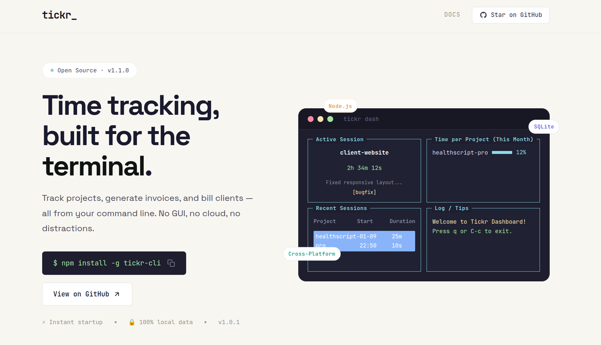
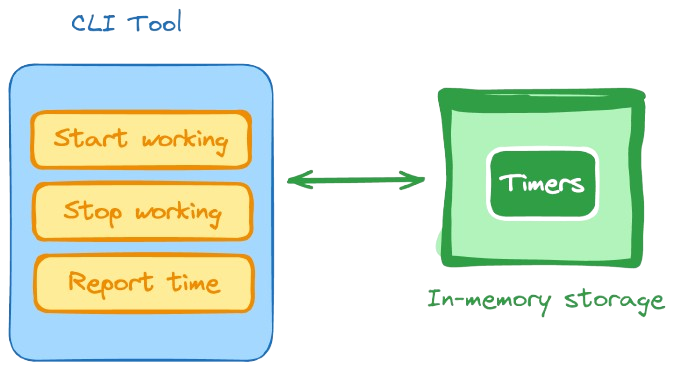

<p align="center">
  
</p>

# Tickr

**Time that adds up.**

Tickr is a CLI-first time-tracking tool designed for freelancers, consultants, and engineers who need accurate, auditable work logs without relying on bloated GUIs. It bridges the gap between your effort and client trust with verifiable time reports.

## Tech Stack

    

## Features

- ⏱️ **Precise Time Tracking**: Start and stop work sessions per project.
- 🤝 **Build Trust**: Produce detailed, transparent logs that give clients confidence in your billed hours.
- 🧱 **Immutable Data**: Work sessions are stored securely in a local SQLite database (`~/.tickr/tickr.db`).
- 📊 **Interactive Reporting**: Generate reports filtered by date and project.
- 🖥️ **Terminal Dashboard**: Visual dashboard with real-time stats (`tickr dash`).
- 🍅 **Pomodoro Timer**: Built-in 25-minute focus timer (`tickr pomo`).
- 🧾 **PDF Invoicing**: Generate professional PDF invoices and summaries.
- 🧠 **Smart Logic**: Automatically handles overlapping sessions and ensures data integrity.

<p align="center">
  
</p>

## Installation
```bash
npm install -g tickr-cli
```

### Core Commands

#### Start & Stop
Start tracking time for a project. If another session is active, it stops automatically.
```bash
tickr start <project>   # Start tracking
tickr stop              # Stop tracking
tickr status            # Check current session
```

#### Dashboard
Launch the interactive terminal dashboard to view history and stats.
```bash
tickr dash
```

### Productivity

#### Pomodoro Timer
Start a 25-minute focus session.
```bash
tickr pomo <project>
```

### Reporting & Invoices

#### CLI Report
Generate a text-based summary of time spent.
```bash
tickr report [project]                   # specific project
tickr report --since 2024-01-01          # custom date range
```

#### PDF Summary
Generate a detailed PDF project summary.
```bash
tickr summary <project>
```

#### PDF Invoice
Generate a billable PDF invoice.
```bash
tickr invoice <project> --rate 100       # $100/hr rate
```

### Email Integration

#### 1. Setup SMTP
Configure your email provider to enable sending reports.
```bash
tickr config --host smtp.gmail.com --port 587 --user me@gmail.com --pass "app-password"
```
*Tip: Use App Passwords for Gmail/Outlook.*

#### 2. Configure Project
Link emails to a project for auto-sending.
```bash
tickr project <name> --user-email me@example.com --client-email client@co.com
```

#### 3. Send
Reports, Summaries, and Invoices will automatically be emailed if configured.
```bash
tickr report <project>      # Emails text report
tickr summary <project>     # Emails PDF summary
tickr invoice <project>     # Emails invoice PDF
```

## Data Storage
Data is stored in `~/.tickr/tickr.db`.
You can back up this file to save your history.


## Development

Run tests:
```bash
node test/suite.js
```
